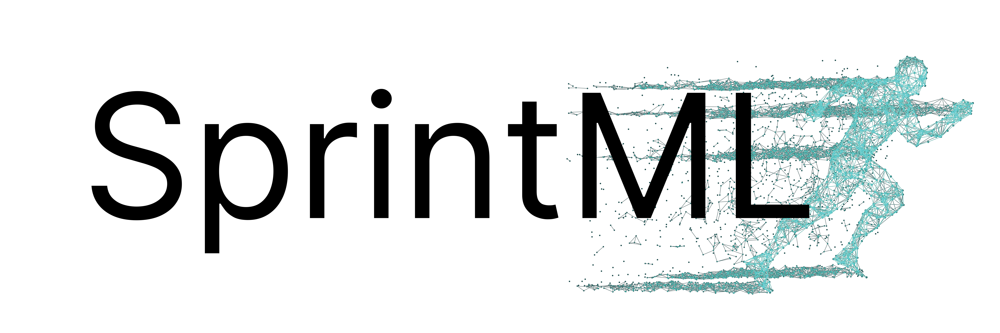

<div align="center">

<a href="https://layer6.ai/"></a>
<a href="https://sprintml.com/"></a>

[](https://arxiv.org/abs/2609.XXXXX)

# TFM Dataset Inference

</div>

A Python library for auditing data provenance and privacy for pre-training datasets of tabular foundation models.

## Installation

We use `uv` as a package manager. Install `uv` first, then run

```
uv sync
```

You may also need a C++ compiler such as `g++` for building dependencies. On Ubuntu, you can install it with:
```
sudo apt-get update
sudo apt-get install g++
```

Lastly, you may need a `python-dev` system package. On Ubuntu, it can be installed with:
```
sudo apt-get update
sudo apt-get install python3-dev
```

### Tips

If you experience errors caused by `torch compile` (e.g., `InductorError`), try updating package versions and system drivers. 

## Dataset Inference (DI) Evaluation

This repository includes a comprehensive system for evaluating dataset inference on tabular foundation models. We define two threat models for DI: external audit where DI uses an anomaly detection approach with labels available only for the negative class, and internal audit treating DI as a binary classification problem with ground truth labels.

### Supported Models

- **TabDPT**: Uses OpenML datasets (members: 123 TabDPT training datasets, non-members: CC18 and CTR23)
- **SAP-RPT-1-OSS**: Uses T4 dataset (members: tables with >150 rows, non-members: tables with ≤150 rows)
- **RealTabPFN-2**: Uses OpenML datasets (members: 37 training datasets, non-members 29 test datasets)
- **RealTabPFN-2.5**: Uses OpenML datasets (members: 20 training datasets, non-members 51 TabArena datasets)
- **NanoTabPFN**: Uses synthetic dataset created by prior generators. We use the datasets provided by the [TFMplayground repo](https://github.com/automl/TFM-Playground/) and split the dataset 50/50 for training and half for non-members.

### Quick Start

#### TabDPT DI

```bash
# Test (2+2 datasets from OpenML)
uv run run_di.py attack=fast dataset=binary_openml_test model=tabdpt

# Small evaluation (10+10 datasets)
uv run run_di.py attack=fast dataset=binary_small model=tabdpt

# All datasets (123+107 datasets)
uv run run_di.py attack=fast dataset=binary_all_tabdpt model=tabdpt
```

#### SAP-RPT-1-OSS DI (requires `pip install .[sap-rpt-oss]` or `uv sync --extra sap-rpt-oss`)

```bash
# Test (2+2 datasets from T4)
uv run run_di.py attack=fast dataset=binary_t4_test model=sap-rpt-oss

# Small evaluation (10+10 datasets)
uv run run_di.py attack=fast dataset=binary_t4_small model=sap-rpt-oss

# All T4 datasets
uv run run_di.py attack=fast dataset=binary_t4_all model=sap-rpt-oss
```

#### nanotabpfn DI:
Prerequisites:
1. Run `git submodule update --init` to initialize the tfm_playground submodule. 
2. Run `uv run download_synthetic_data.py`. This will Download [50x3_3_100k_classification.h5](https://ml.informatik.uni-freiburg.de/research-artifacts/pfefferle/TFM-Playground/50x3_3_100k_classification.h5) and [50x3_1280k_regression.h5](https://ml.informatik.uni-freiburg.de/research-artifacts/pfefferle/TFM-Playground/50x3_1280k_regression.h5) provided by TFM-playground and create train/holdout splits.
3. Run `uv run train_nanotabpfn_classifier.py` and `uv run train_nanotabpfn_regressor.py` to train the classifier and regressor respectively. The weights of these models will be stored at `models/nanotabpfn`.

Then start the DI. The synthetic classification corpus has 50,000 train
(member) + 50,000 holdout (non-member) tables; pick the config whose size
fits your wall clock:

```bash
# Test        (10 + 10,      0.02% coverage) — seconds
uv run run_di.py attack=fast dataset=nanotabpfn_test   model=nanotabpfn
# Small       (100 + 100,    0.4% coverage)  — ~10–20 min on a single GPU
uv run run_di.py attack=fast dataset=nanotabpfn_small  model=nanotabpfn
# Medium      (1000 + 1000,  4% coverage)    — ~1–3 h
uv run run_di.py attack=fast dataset=nanotabpfn_medium model=nanotabpfn
# Large       (10000+10000,  40% coverage)   — ~10–30 h; SLURM array recommended
uv run run_di.py attack=fast dataset=nanotabpfn_large  model=nanotabpfn
# All         (50000+50000,  100% coverage)  — multi-day; always array it
uv run run_di.py attack=fast dataset=nanotabpfn_all    model=nanotabpfn
```

Only `50x3_3_100k_classification.h5` (78 MB) is required for the configs
above — the first-N selection keeps all four non-test configs inside the
classification corpus. The regression H5 (1 GB) is only needed if you want
to infer on the regression half of NanoTabPFN.


### About T4 dataset

The codebase will try to automatically download T4 dataset from huggingface. Before downloading the dataset, you need to first install huggingface cli and log in with `hf auth login`. Then you need to accept the terms and conditions of using T4 dataset [here](https://huggingface.co/datasets/mlfoundations/t4-full). As the whole T4 dataset is very large, currently we only test our codebase on a single chunk of data (chunk-0002).

**Note**: SAP-RPT-1-OSS was trained on all T4 datasets with over 150 rows. When deciding the dataset membership of that model, on first run, the system scans all available T4 parquet files (20,000+) to classify them as members (>150 rows) or non-members (≤150 rows), and save the results in cache. This initial scan takes several minutes. Subsequent runs use the cache and are fast.

If you want to pre-generate the cache:
```bash
uv run python -c "from di import dataset_selection; dataset_selection.get_model_datasets('sap-rpt-oss')"
```

### System Overview

The DI evaluation system:

- **Single Entrypoint**: `run_di.py` - Hydra-based configuration system
- **Ground Truth Labels**: 
  - e.g. TabDPT: IDs from published works ([di/datasets/tabdpt_training_ids.py](di/datasets/tabdpt_training_ids.py))
  - e.g. SAP-RPT-1-OSS: Dynamic labels based on T4 dataset row count ([di/datasets/sap_rpt_oss_training_ids.py](di/datasets/sap_rpt_oss_training_ids.py))
- **Binary Classification**: Treats DI as binary classifier (member vs non-member)
- **Metrics**: ROC-AUC, precision, recall, F1, confusion matrix
- **Visualizations**: 6-panel plots with ROC curves, PR curves, score distributions

### Output Files

Each `run_di.py` invocation writes the following into its Hydra output dir
(`./experiments/outputs/YYYY-MM-DD/HH-MM-SS/` by default):

- **`datasets.parquet`** — one row per attacked dataset, columns are the full
  dataset-level grid signals plus `dataset_id`, `dataset_name`, `label`
  (1 = member, 0 = non-member). This is the table the meta-classifier consumes.
- **`samples.parquet`** — one row per held-out query sample, columns are the
  per-sample signals (base features and per-sweep stability stats: `mean`,
  `std`, `range`, `slope`) plus `dataset_id`, `sample_idx`, `label`. Used for
  row-level / split-model DI analysis.
- **JSON results**: complete metrics + metadata.

The parquet pair is emitted for every model.

### Multi-Model Variants

In addition to the base configs, the following Hydra model configs are
available out-of-the-box. All non-default weights are auto-downloaded from the
[`dwahdany/tfms`](https://huggingface.co/dwahdany/tfms) HuggingFace repo on
first use (no extra steps — the HF cache handles it):

## Citation

If you find this repository useful, please cite the paper as follows

```bibtex
@article{huang2026unifying,
      title={Dataset Inference for Data Provenance and Privacy Auditing in Tabular Foundation Models}, 
      author={Dariush Wahdany and Jesse C. Cresswell and Naiqing Guan and Atiyeh Ashari Ghomi and Franziska Boenisch and Adam Dziedzic},
      year={2026},
      journal={arXiv:2609.XXXXX}
}
```

## License

Apache 2.0
